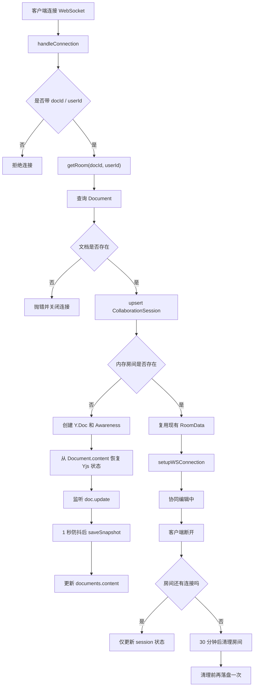

# Yjs 本地存储改动视图

## 目标

这次修改的目标是把服务端的 `Y.Doc` 持久化链路补完整，让协同文档具备下面几项能力：

- 首次进入房间时，从数据库恢复历史 `Y.Doc` 状态
- 编辑过程中，把最新 `Y.Doc` 状态定时写回数据库
- 所有客户端断开后，房间不会立刻销毁，而是延迟清理
- 清理前再做一次最终落盘，避免内存中的最新状态丢失

---

## 改动文件总览

| 文件 | 改动目的 |
| --- | --- |
| `src/yjs/yjs.gateway.ts` | 重写房间生命周期、恢复逻辑、延迟持久化逻辑 |
| `src/module/yjs-storage/yjs-storage.service.ts` | 增加 `Y.Doc` 编解码、数据库读写、会话更新 |
| `src/module/yjs-storage/yjs-storage.controller.ts` | 修正创建文档接口的入参读取方式 |
| `src/module/yjs-storage/yjs-storage.module.ts` | 注册并导出 `YjsStorageService` |
| `src/app.module.ts` | 引入 `StorageModule`，让网关可正常注入存储服务 |

---

## 整体流程

---

## 1. `src/yjs/yjs.gateway.ts`

文件位置：
[src/yjs/yjs.gateway.ts](/D:/Web/AnewP/yjs-text/src/yjs/yjs.gateway.ts:1)

### 主要改了什么

#### 1. 房间缓存结构统一成按 `docId` 管理

关键位置：
[src/yjs/yjs.gateway.ts:16](/D:/Web/AnewP/yjs-text/src/yjs/yjs.gateway.ts:16)
[src/yjs/yjs.gateway.ts:33](/D:/Web/AnewP/yjs-text/src/yjs/yjs.gateway.ts:33)

改动点：

- 增加 `RoomData` 结构，统一管理：
  - `doc`
  - `awareness`
  - `connectionCount`
  - `cleanupTimer`
  - `persistTimer`
- 用 `Map<string, RoomData>` 存房间
- 房间 key 统一使用 `docId`

这么改的原因：

- 之前房间 key 混用了 `docId` 和 `session.id`
- 这样会导致同一个文档重复建房
- 断开连接时也可能找不到正确房间

#### 2. 增加房间持久化防抖

关键位置：
[src/yjs/yjs.gateway.ts:46](/D:/Web/AnewP/yjs-text/src/yjs/yjs.gateway.ts:46)
[src/yjs/yjs.gateway.ts:56](/D:/Web/AnewP/yjs-text/src/yjs/yjs.gateway.ts:56)

改动点：

- 新增 `schedulePersist`
- 新增 `persistRoom`
- 每次 `doc.on('update')` 后不立刻写库，而是 1 秒后统一保存

这么改的原因：

- Yjs 更新非常频繁
- 每次输入都立刻写数据库会造成大量无效写入
- 防抖可以降低数据库压力

#### 3. 房间首次创建时从数据库恢复 Yjs 状态

关键位置：
[src/yjs/yjs.gateway.ts:91](/D:/Web/AnewP/yjs-text/src/yjs/yjs.gateway.ts:91)
[src/yjs/yjs.gateway.ts:108](/D:/Web/AnewP/yjs-text/src/yjs/yjs.gateway.ts:108)

改动点：

- `getRoom` 先查 `Document`
- 如果内存里没有房间，就新建 `Y.Doc`
- 从 `Document.content` 读取保存过的状态
- 用 `Y.applyUpdate` 把数据库状态恢复到内存里的 `doc`

这么改的原因：

- 服务重启后，内存房间会消失
- 如果不从数据库恢复，之前协同内容就读不回来

#### 4. 客户端断开时延迟清理

关键位置：
[src/yjs/yjs.gateway.ts:66](/D:/Web/AnewP/yjs-text/src/yjs/yjs.gateway.ts:66)
[src/yjs/yjs.gateway.ts:187](/D:/Web/AnewP/yjs-text/src/yjs/yjs.gateway.ts:187)

改动点：

- 断开后先减少 `connectionCount`
- 如果房间没人了，不立即销毁
- 等待 `30 * 60 * 1000` 毫秒再清理
- 清理时会先做一次最终持久化

这么改的原因：

- 用户短时间刷新页面或重连时，不需要重新构建房间
- 也能避免最后一次编辑尚未写库就被清掉

#### 5. 连接参数校验更明确

关键位置：
[src/yjs/yjs.gateway.ts:138](/D:/Web/AnewP/yjs-text/src/yjs/yjs.gateway.ts:138)

改动点：

- 校验 `docId`
- 校验 `userId`
- 参数缺失时直接关闭连接

这么改的原因：

- 避免把不完整参数一路传进数据库逻辑
- 错误更早暴露，问题更容易排查

---

## 2. `src/module/yjs-storage/yjs-storage.service.ts`

文件位置：
[src/module/yjs-storage/yjs-storage.service.ts](/D:/Web/AnewP/yjs-text/src/module/yjs-storage/yjs-storage.service.ts:1)

### 主要改了什么

#### 1. 增加 ID 规范化

关键位置：
[src/module/yjs-storage/yjs-storage.service.ts:24](/D:/Web/AnewP/yjs-text/src/module/yjs-storage/yjs-storage.service.ts:24)

改动点：

- 新增 `normalizeId`
- 把 `string | number` 转成数据库使用的数值 ID
- 非合法数字时直接抛错

这么改的原因：

- WebSocket 参数通常是字符串
- Prisma 查询和外键写入需要稳定的数字 ID

#### 2. 增加 Yjs 状态编解码

关键位置：
[src/module/yjs-storage/yjs-storage.service.ts:39](/D:/Web/AnewP/yjs-text/src/module/yjs-storage/yjs-storage.service.ts:39)
[src/module/yjs-storage/yjs-storage.service.ts:43](/D:/Web/AnewP/yjs-text/src/module/yjs-storage/yjs-storage.service.ts:43)
[src/module/yjs-storage/yjs-storage.service.ts:60](/D:/Web/AnewP/yjs-text/src/module/yjs-storage/yjs-storage.service.ts:60)

改动点：

- `createEmptyState`
- `decodeState`
- `encodeState`

保存方式：

- `Y.encodeStateAsUpdate(doc)` 得到完整状态
- 转成 `number[]`
- 存入 `Document.content`

恢复方式：

- 从 `Document.content` 读出 `number[]`
- 转成 `Uint8Array`
- 再 `Y.applyUpdate(doc, update)`

这么改的原因：

- 当前表结构里 `content` 是 `JsonB`
- 不能直接存 `Uint8Array`
- 转成 `number[]` 后可以稳定落到 JSON 字段里

#### 3. 补全文档持久化

关键位置：
[src/module/yjs-storage/yjs-storage.service.ts:64](/D:/Web/AnewP/yjs-text/src/module/yjs-storage/yjs-storage.service.ts:64)

改动点：

- `saveSnapshot(id, doc)`
- 用最新的 `doc` 重新编码
- 更新 `document.content`
- 顺便把 `version` 自增

这么改的原因：

- 之前 `saveSnapshot` 是空实现
- 网关能收到更新，但没有真正落盘

#### 4. 文档查询和恢复接口补全

关键位置：
[src/module/yjs-storage/yjs-storage.service.ts:79](/D:/Web/AnewP/yjs-text/src/module/yjs-storage/yjs-storage.service.ts:79)
[src/module/yjs-storage/yjs-storage.service.ts:91](/D:/Web/AnewP/yjs-text/src/module/yjs-storage/yjs-storage.service.ts:91)

改动点：

- `getDocument`
- `getDocumentUpdate`
- `getLocalData`

这么改的原因：

- 网关需要稳定读取数据库中的历史状态
- 把查询逻辑统一收口到存储服务里

#### 5. 文档创建接口补全

关键位置：
[src/module/yjs-storage/yjs-storage.service.ts:100](/D:/Web/AnewP/yjs-text/src/module/yjs-storage/yjs-storage.service.ts:100)

改动点：

- `createDocument`
- 没传内容时会创建一个空 Yjs 状态
- 默认标题为 `Untitled document`
- 默认 `createdBy` 为 `1`

这么改的原因：

- 之前创建接口没有真正落数据库
- 要让文档能先建记录，再允许协同连接

注意：

- 这里默认 `createdBy = 1`
- 所以前提是数据库里存在 `id = 1` 的用户

#### 6. 会话状态更新补全

关键位置：
[src/module/yjs-storage/yjs-storage.service.ts:135](/D:/Web/AnewP/yjs-text/src/module/yjs-storage/yjs-storage.service.ts:135)
[src/module/yjs-storage/yjs-storage.service.ts:159](/D:/Web/AnewP/yjs-text/src/module/yjs-storage/yjs-storage.service.ts:159)

改动点：

- `handleSessionRoom`
- `markSessionDisconnected`

行为：

- 进入房间时 `upsert` 会话
- 断开连接时把 `isActive` 改成 `false`
- 同时刷新 `lastSeen`

这么改的原因：

- 让数据库里的会话状态和实际在线状态对齐

当前已知限制：

- `handleSessionRoom` 依赖 `userId` 在 `users` 表里存在
- 否则会触发外键错误

---

## 3. `src/module/yjs-storage/yjs-storage.controller.ts`

文件位置：
[src/module/yjs-storage/yjs-storage.controller.ts](/D:/Web/AnewP/yjs-text/src/module/yjs-storage/yjs-storage.controller.ts:1)

### 主要改了什么

关键位置：
[src/module/yjs-storage/yjs-storage.controller.ts:10](/D:/Web/AnewP/yjs-text/src/module/yjs-storage/yjs-storage.controller.ts:10)

改动点：

- 之前从 `@Req()` 里读 `doc`
- 现在改成从 `@Body()` 直接收文档创建参数

这么改的原因：

- 创建接口本质上是标准 HTTP `POST`
- 直接用 `Body` 更符合 NestJS 的接口写法
- 也避免 `req.doc` 这种默认不存在的字段

---

## 4. `src/module/yjs-storage/yjs-storage.module.ts`

文件位置：
[src/module/yjs-storage/yjs-storage.module.ts](/D:/Web/AnewP/yjs-text/src/module/yjs-storage/yjs-storage.module.ts:1)

### 主要改了什么

关键位置：
[src/module/yjs-storage/yjs-storage.module.ts:6](/D:/Web/AnewP/yjs-text/src/module/yjs-storage/yjs-storage.module.ts:6)

改动点：

- 引入 `PrismaModule`
- 注册 `YjsStorageService`
- 导出 `YjsStorageService`

这么改的原因：

- 让存储服务成为一个可复用模块
- 让 `YjsCollabGateway` 可以通过依赖注入拿到它

---

## 5. `src/app.module.ts`

文件位置：
[src/app.module.ts](/D:/Web/AnewP/yjs-text/src/app.module.ts:1)

### 主要改了什么

关键位置：
[src/app.module.ts:10](/D:/Web/AnewP/yjs-text/src/app.module.ts:10)

改动点：

- 引入 `StorageModule`
- 移除直接在 `providers` 里手工塞 `YjsStorageService` 的方式

这么改的原因：

- 让模块边界更清晰
- 统一走 Nest 模块导入/导出机制

---

## 当前功能边界

### 已支持

- 已存在文档时，首次连接自动创建内存房间
- 编辑时自动落盘 `Document.content`
- 重连时从数据库恢复历史内容
- 房间无人后延迟清理

### 还未支持或仍有风险

- 文档不存在时自动创建文档
- 用户不存在时自动创建用户
- `client.close()` 直接带长错误文本，可能触发 `123 bytes` 限制

---

## 最近暴露出的两个问题

### 1. 用户外键错误

你看到的报错来自：
[src/module/yjs-storage/yjs-storage.service.ts:139](/D:/Web/AnewP/yjs-text/src/module/yjs-storage/yjs-storage.service.ts:139)

原因：

- `collaborationSession.userId` 关联 `users.id`
- 当前传入的 `userId` 在数据库里不存在
- 所以 `upsert` 会失败

### 2. WebSocket close reason 过长

你看到的 `RangeError` 来自：
[src/yjs/yjs.gateway.ts:183](/D:/Web/AnewP/yjs-text/src/yjs/yjs.gateway.ts:183)

原因：

- `client.close(4500, message)` 里的 `message` 是整段 Prisma 错误
- WebSocket 协议规定 close reason 不能超过 123 字节

---

## 建议的下一步修改

如果继续完善，建议按下面顺序补：

1. 在进入房间前先校验 `userId` 是否真实存在
2. `client.close()` 改成短错误文案，比如 `user_not_found`
3. 视业务决定是否支持：
   - 文档不存在时自动创建 `Document`
   - 用户不存在时自动创建 `User`

---

## 一句话总结

这次修改的核心是把 `Y.Doc` 从“只存在内存里”改成了“内存房间 + 数据库快照”双层结构，并补上了房间恢复、延迟落盘和模块注入；当前主要剩余问题集中在“用户外键校验”和“连接失败时的错误关闭方式”。
